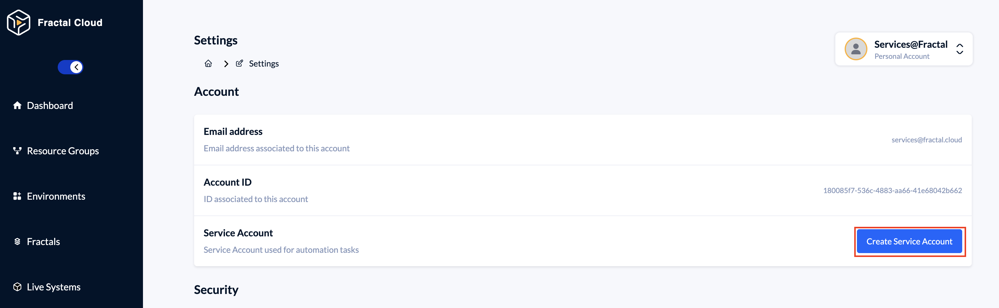
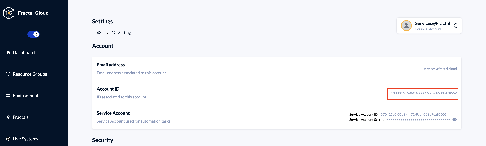

# Terraform Provider Sample
Sample using Fractal Cloud Terraform Provider to initialize Environments and Fractals, as an alternative to use the Java SDK as shown [in this example](https://github.com/Fractal-Cloud/automotive-with-fractal-cloud).

The goal of Fractal Cloud is to simplify, standardize and govern infrastructure at scale. Achieving this depends on whether Ops and Dev teams can work together in a consistent and efficient way.

This example shows how Ops teams can use the technology they already know to define Fractals, namely Terraform HCL, while developers consume them through the tools and languages they prefer such as Java, C# or Typescript. This creates a shared model where infrastructure is governed by design and developers can move without friction.

## Code organization

In the `provider.tf` file you can initialize the provider using the Service Account ID and Secret you can find using the Fractal Cloud Web UI.

These information can also be provided through the use of the `FRACTAL_CLOUD_SERVICE_ACCOUNT_ID` and `FRACTAL_CLOUD_SERVICE_ACCOUNT_SECRET` evironment variables.

In the `resource-groups.tf` file you will find the Resource Groups defined to segment your IT Landscape in different zones so that different teams have access to different portion of your infrastructure.

To use this sample, you should substitute the `owner_id` with the one found through the Fractal Cloud Web UI, as shown in the screenshot below:

The `environments.tf` and `fractals.tf` contains the definition of Environments and Fractals respectively.